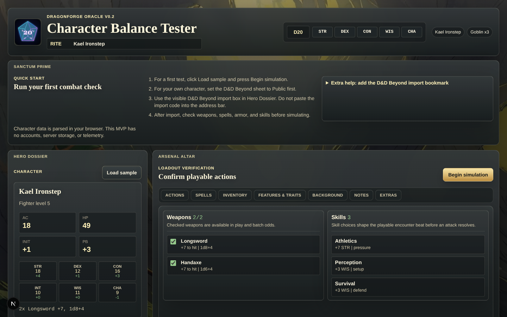
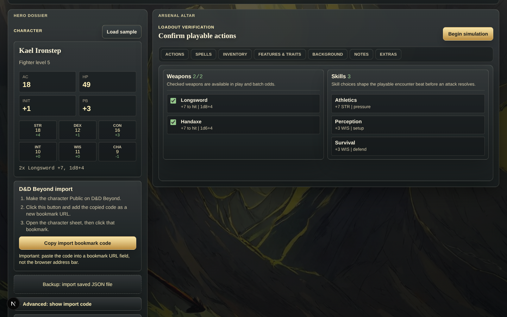

# D&D Character Balance Tester

> **Status — work in progress.** Single-character imports, deterministic dice, and Monte-Carlo runs against fixed encounters work. Active work in progress: party-of-N support, smarter combat AI (target prioritization, reactions, legendary actions), spell-slot tracking, and movement/cover. The README "Roadmap / Limitations" section below lists the known gaps in detail.

A local-first D&D 5e combat simulator built with TypeScript, React, and Electron. Import a character from D&D Beyond, configure an encounter against SRD monsters, and run Monte-Carlo simulations to see how the character actually performs — win rate, average damage dealt and taken, round counts, and turn-by-turn combat logs across many seeded runs.

## Why

Balancing a tabletop character or designing an encounter is largely guesswork. A single playtest is one sample from a high-variance distribution of d20 outcomes. This tool runs that distribution end-to-end: hundreds of full combats, deterministic when seeded, with attack-by-attack logs so you can see *why* a build is fragile or overtuned before bringing it to the table. It is meant for players prototyping characters, DMs sanity-checking encounter difficulty, and anyone curious about the math underneath 5e combat.

## Features

- **D&D Beyond character import** via a one-click bookmarklet that fetches the official character JSON and hands it off to the app.
- **Deterministic dice RNG** (a seeded `mulberry32`-style PRNG) so every run is reproducible from a string seed; falls back to `Math.random` when no seed is provided.
- **Full attack-resolution engine** with d20 to-hit, natural 1 / natural 20 handling, critical hits (double dice), per-attack damage rolls, and multi-attack actions (`attacksPerAction`).
- **Monte-Carlo aggregation** across configurable iteration counts (10 / 20 / 50 / 100), reporting win rate, average rounds, and average damage dealt and taken per round.
- **Turn-by-turn combat log** with initiative order, per-event d20 rolls, hit/miss/crit verdicts, damage applied, and remaining target HP.
- **Encounter builder** against an SRD 5.1 monster catalog with selectable monster counts.
- **"Playable encounter" mode** — step through a single combat one round at a time with steady / guarded / reckless playstyle hints.
- **Spell effect parsing** for save-or-suck spells, attack-modifier spells, and concentration-style ongoing effects.
- **Vitest test suite** covering the dice engine, combat resolver, character parser, and bookmarklet generation.
- **Ships as both a Next.js dev app and a packaged Windows desktop** via Electron + electron-builder (NSIS installer and portable EXE).

## Tech Stack

- TypeScript ^6.0.3
- React ^19.2.6 / React DOM ^19.2.6
- Next.js ^16.2.5 (App Router, static export for desktop builds)
- Electron ^42.0.0 + electron-builder ^26.8.1
- Vitest ^4.1.5
- Node types: `@types/node` ^25.6.0

## Setup

```bash
# install
npm install

# run the web app in dev mode (http://127.0.0.1:3001)
npm run dev

# run tests
npm test

# typecheck
npm run typecheck
```

Desktop (Electron) builds:

```bash
# launch the desktop shell against a production build
npm run desktop

# build a Windows NSIS installer + portable EXE
npm run desktop:dist

# build only the NSIS setup into release-current/
npm run desktop:dist:setup
```

The packaged app spins up a small local HTTP server inside Electron (default port `3217`, override with `DND_SIM_PORT`) and serves the statically exported Next.js `out/` directory.

## How it works

The combat engine lives in [`src/engine/combat.ts`](src/engine/combat.ts). Each `simulateCombatRun` builds runtime combatants for the hero and N monster instances, rolls initiative (d20 + bonus, ties broken by raw d20), then loops rounds up to a 50-round safety cap. On every turn the engine resolves the actor's first attack via `resolveAttack`: it rolls a d20, treats nat 1 as auto-miss and nat 20 as auto-crit, otherwise compares `d20 + toHit` against target AC, and rolls damage (with doubled dice on a crit) summed from typed `DiceTerm`s. Damage is clamped to remaining HP, totals are accumulated for both sides, and a structured `CombatLogEvent` is pushed for the UI. `runSimulation` then wraps that in a Monte-Carlo loop, deriving a per-iteration seed (`${seed}-${i}`) so an entire batch is reproducible from one root string.

Dice randomness uses a seeded `mulberry32`-style PRNG in [`src/engine/dice.ts`](src/engine/dice.ts), seeded from a `xmur3`-style string hash. The character import flow ([`src/parsers/ddbCharacter.ts`](src/parsers/ddbCharacter.ts)) is fed by a bookmarklet ([`src/utils/bookmarklet.ts`](src/utils/bookmarklet.ts)) that calls the D&D Beyond character service from the user's authenticated browser session and `postMessage`s the JSON into the app's `/import` page, where it is normalized into the simulator's internal `CombatCharacter` shape (ability scores, AC, HP, attacks, spells, features).

## Screenshots





> A combat-log screenshot will be added with the next capture pass.

## Roadmap / Limitations

This project is pre-public and being prepared for portfolio review; expect rough edges.

- Combat AI is intentionally minimal — actors use their first declared attack each turn; no spell-slot management, target prioritization, movement, cover, reactions, or legendary actions.
- Round limit hard-capped at 50 (treated as a monster win) to bound runtime.
- Monster catalog is a small SRD 5.1 subset; adding monsters means editing `src/data/srdMonsters.ts`.
- Spell handling covers attack-roll and basic save-based effects; full 5e spell coverage is not in scope yet.
- D&D Beyond import requires the character privacy to be set to **Public**; the bookmarklet runs against the user's own logged-in session and falls back to a "paste raw JSON" path on failure.

### Disclaimer

This project is not affiliated with or endorsed by Wizards of the Coast or D&D Beyond. The D&D Beyond import path uses publicly accessible character JSON fetched from the user's own authenticated browser session and is intended strictly for personal balance analysis of characters the user owns. Monster stat blocks ship from the SRD 5.1, used under the Open Game License / Creative Commons terms applicable to that document. "Dungeons & Dragons" and "D&D Beyond" are trademarks of their respective owners.

## License

MIT — see [LICENSE](LICENSE).
